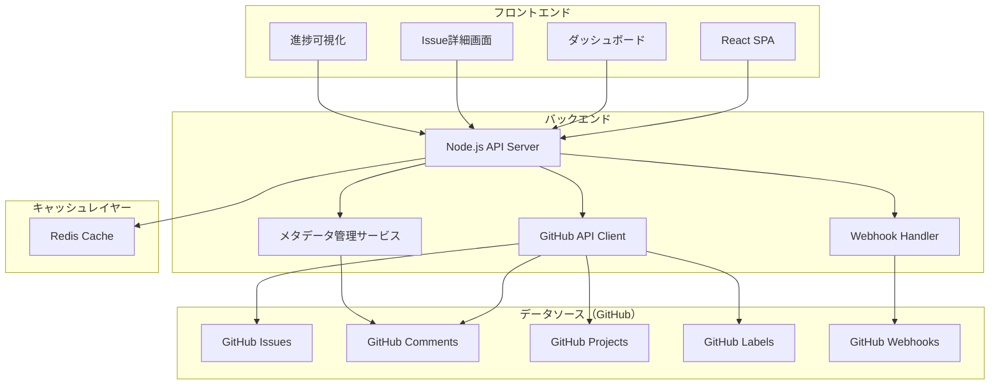

# 設計書

## 概要

GitHubのissue管理を拡張するWebアプリケーションシステムです。GitHub APIを活用してissueデータを取得・同期し、追加のメタデータ管理、進捗可視化、依存関係管理、時間追跡などの高度なタスク管理機能を提供します。

## アーキテクチャ

### システム構成



### 技術スタック

**フロントエンド:**
- React 18 with TypeScript
- Material-UI for UI components
- Chart.js for data visualization
- React Query for API state management

**バックエンド:**
- Node.js with Express.js
- TypeScript
- Prisma ORM for database operations
- Bull Queue for background job processing

**キャッシュ:**
- Redis for API response caching and session management

**データストレージ:**
- GitHub Issues as primary data source
- GitHub Comments for metadata storage
- GitHub Projects for advanced organization
- GitHub Labels for categorization

**外部連携:**
- GitHub REST API v4
- GitHub GraphQL API v4
- GitHub Webhooks for real-time updates

## コンポーネントとインターフェース

### APIエンドポイント

```typescript
// Issue管理
GET    /api/issues                    // Issue一覧取得
GET    /api/issues/:id                // Issue詳細取得
PUT    /api/issues/:id/metadata       // メタデータ更新
POST   /api/issues/:id/time-entries   // 時間エントリ追加

// 依存関係管理
GET    /api/issues/:id/dependencies   // 依存関係取得
POST   /api/issues/:id/dependencies   // 依存関係追加
DELETE /api/dependencies/:id          // 依存関係削除

// ダッシュボード
GET    /api/dashboard/progress        // 進捗データ取得
GET    /api/dashboard/workload        // 作業負荷データ取得

// 同期
POST   /api/sync/github              // 手動同期実行
POST   /api/webhooks/github          // GitHub Webhook受信
```

### フロントエンドコンポーネント

```typescript
// メインコンポーネント
- App.tsx                    // アプリケーションルート
- Dashboard.tsx              // ダッシュボード画面
- IssueList.tsx             // Issue一覧画面
- IssueDetail.tsx           // Issue詳細画面

// 共通コンポーネント
- IssueCard.tsx             // Issueカード表示
- MetadataEditor.tsx        // メタデータ編集
- DependencyGraph.tsx       // 依存関係グラフ
- TimeTracker.tsx           // 時間追跡
- ProgressChart.tsx         // 進捗チャート
```

## データモデル

### GitHubベースのデータ保存戦略

**Phase 1: ラベル中心のメタデータ管理**

1. **GitHub Labels での主要メタデータ**
   ```typescript
   // 優先度ラベル
   "priority:critical", "priority:high", "priority:medium", "priority:low"
   
   // カテゴリラベル  
   "category:frontend", "category:backend", "category:design", "category:testing", "category:docs"
   
   // 工数見積もりラベル
   "size:xs", "size:small", "size:medium", "size:large", "size:xl"
   
   // ステータスラベル
   "status:todo", "status:in-progress", "status:review", "status:done"
   ```

2. **Issue Body での依存関係表現**
   ```markdown
   ## Dependencies
   - Depends on: #123, #456
   - Blocks: #789, #101
   ```

3. **時間追跡の簡易実装**
   ```typescript
   // 作業時間をラベルで追跡（Phase 1）
   "time-spent:0-2h", "time-spent:2-4h", "time-spent:4-8h", "time-spent:8h+"
   ```

**将来の拡張計画:**
- Phase 2: ハイブリッド方式（ラベル + コメント）
- Phase 3: 完全な構造化データ管理

### TypeScript型定義

```typescript
// GitHub APIから取得する基本Issue情報
interface GitHubIssue {
    id: number;
    number: number;
    title: string;
    body: string;
    state: 'open' | 'closed';
    assignees: GitHubUser[];
    labels: GitHubLabel[];
    created_at: string;
    updated_at: string;
}

// Phase 1: ラベルベースのメタデータ
interface LabelBasedMetadata {
    priority: 'low' | 'medium' | 'high' | 'critical';
    category: 'frontend' | 'backend' | 'design' | 'testing' | 'docs';
    estimatedSize: 'xs' | 'small' | 'medium' | 'large' | 'xl';
    status: 'todo' | 'in-progress' | 'review' | 'done';
    timeSpent?: 'none' | '0-2h' | '2-4h' | '4-8h' | '8h+';
}

// 統合されたIssue情報
interface ExtendedIssue extends GitHubIssue {
    metadata: LabelBasedMetadata;
    parsedDependencies: ParsedDependency[];
}

// Issue bodyから解析される依存関係
interface ParsedDependency {
    type: 'depends_on' | 'blocks';
    issueNumber: number;
    repository?: string; // クロスリポジトリ依存関係用
}

// 将来の拡張用インターフェース（Phase 2以降）
interface DetailedMetadata extends LabelBasedMetadata {
    estimatedHours?: number;
    timeEntries?: TimeEntry[];
    changeHistory?: MetadataChange[];
}

interface TimeEntry {
    userId: string;
    startTime: string;
    endTime?: string;
    durationMinutes?: number;
    description?: string;
}

interface MetadataChange {
    timestamp: string;
    changedBy: string;
    field: string;
    oldValue: any;
    newValue: any;
    reason?: string;
}
```

## エラーハンドリング

### エラー分類と対応

**GitHub API エラー:**
- レート制限超過: 指数バックオフによるリトライ
- 認証エラー: ユーザーに再認証を促す
- リソース不存在: 適切なエラーメッセージを表示

**データ整合性エラー:**
- メタデータ解析エラー: デフォルト値での継続処理
- 依存関係循環検出: 警告表示と修正提案
- コメント更新競合: 最新データでの再試行

**GitHub連携エラー:**
- Webhook配信失敗: ポーリングによる定期同期でカバー
- API制限超過: 指数バックオフによる自動リトライ
- 権限不足: ユーザーに適切な権限設定を案内

### エラーログとモニタリング

```typescript
// エラーログ構造
interface ErrorLog {
    timestamp: Date;
    level: 'error' | 'warn' | 'info';
    source: 'github-api' | 'database' | 'webhook' | 'sync';
    message: string;
    details: any;
    userId?: number;
    issueId?: number;
}
```

## テスト戦略

### テストレベル

**ユニットテスト:**
- 各サービスクラスの個別機能テスト
- データモデルのバリデーションテスト
- ユーティリティ関数のテスト
- カバレッジ目標: 80%以上

**統合テスト:**
- GitHub API連携テスト
- メタデータ解析・保存テスト
- Webhook処理テスト
- 依存関係解析テスト

**E2Eテスト:**
- 主要ユーザーフローのテスト
- ダッシュボード表示テスト
- Issue作成・更新フローテスト

### テスト環境

**開発環境:**
- GitHub API: テスト用リポジトリを使用
- データベース: Docker Compose でローカル環境構築
- モックサーバー: GitHub APIのモック応答

**CI/CD:**
- GitHub Actions でテスト自動実行
- プルリクエスト時の自動テスト
- デプロイ前の統合テスト実行

### テストデータ管理

```typescript
// テストデータファクトリー
class TestDataFactory {
    static createGitHubIssue(overrides?: Partial<GitHubIssue>): GitHubIssue;
    static createMetadataComment(metadata: IssueMetadata): string;
    static createTimeEntry(overrides?: Partial<TimeEntry>): TimeEntry;
    static createIssueDependency(overrides?: Partial<IssueDependency>): IssueDependency;
}

// テスト用のGitHubリポジトリ設定
const TEST_REPO = 'test-org/github-task-extension-test';
```

## セキュリティ考慮事項

**認証・認可:**
- GitHub OAuth 2.0による認証
- JWTトークンによるセッション管理
- リポジトリレベルのアクセス制御

**データ保護:**
- 個人アクセストークンの暗号化保存（Redisセッション内）
- HTTPS通信の強制
- GitHub APIトークンの適切なスコープ制限

**API セキュリティ:**
- レート制限の実装
- CORS設定の適切な構成
- 入力値バリデーション

## パフォーマンス最適化

**GitHub API最適化:**
- GraphQL APIによる必要データのみ取得
- 条件付きリクエスト（ETag）による帯域幅削減
- バッチ処理による API コール数削減

**キャッシュ戦略:**
- Redis による GitHub API レスポンスキャッシュ
- メタデータ解析結果のキャッシュ
- 依存関係グラフの計算結果キャッシュ
- フロントエンドでのクエリキャッシュ

**非同期処理:**
- バックグラウンドでのメタデータ解析
- キューシステムによるGitHub API呼び出し制御
- Webhook処理の非同期化
- 依存関係グラフの段階的構築

## GitHubデータ管理の詳細

### メタデータ管理サービス

```typescript
class GitHubMetadataService {
    // メタデータをGitHub Commentとして保存
    async saveMetadata(issueNumber: number, metadata: IssueMetadata): Promise<void>;
    
    // GitHub Commentからメタデータを抽出
    async extractMetadata(issue: GitHubIssue): Promise<IssueMetadata>;
    
    // Issue bodyから依存関係を解析
    parseDependencies(issueBody: string): IssueDependency[];
    
    // ラベルから優先度・カテゴリを抽出
    extractLabelsMetadata(labels: GitHubLabel[]): Partial<IssueMetadata>;
}
```

### データ同期戦略

1. **リアルタイム同期（Webhook）**
   - Issue作成・更新・削除
   - Comment追加・更新・削除
   - Label変更

2. **定期同期（ポーリング）**
   - Webhook失敗時のフォールバック
   - 初回データ取得
   - データ整合性チェック

3. **オンデマンド同期**
   - ユーザーの手動同期要求
   - 特定リポジトリの全データ更新